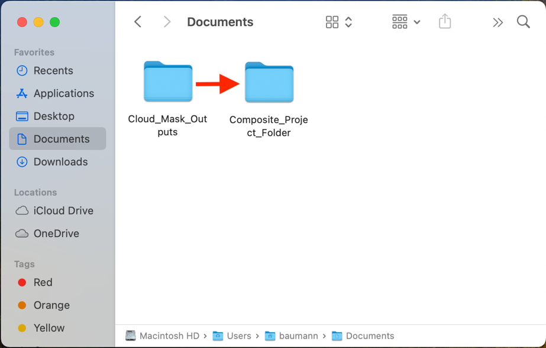
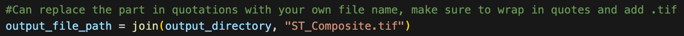

> *This tutorial will show you how to create a composite image of
> ECOSTRESS data using a Python code. The code shows how to make a
> composite of Land Surface Temperature (LST) products, but it can be
> modified for other ECOSTRESS products.*

# Table of Contents

[What is a Composite Image?](#what-is-a-composite-image)

[Creating a Composite Image](#creating-a-composite-image)

# What is a Composite Image?

A composite image is an image made by combining multiple images into
one. Composite images are commonly used in remote sensing to get the
average or median of data for a certain time period. These images can
also help compare changes over time.

## Creating a Composite Image

1.  Download the **Composite** code from
    <https://github.com/ECOSTRESS-Tutorials/ECOSTRESS-Composite>.

2.  Open your **finder**. Create a **project folder** to store all the
    files for this project by **right clicking** and selecting **New
    Folder**. Name your new folder so that you know it is the main
    project folder.

3.  **Move** the **downloaded code** file into the project folder.

4.  **Move** the folder with your QCed or cloud masked **ECOSTRESS
    data** into the project folder.

**Tip**: It is best practice to use input data that has already been
**QCed** or **cloud masked** in order to improve accuracy. If your
ECOSTRESS images are not QCed or cloud masked, follow the **Applying QC
Flags** or **Cloud Masking ECOSTRESS Products** tutorial to set them up
for this tutorial. If you used a different QC or cloud masking method,
or chose to not to QC or cloud mask your images, you may need to
**change the datetime extraction** parts of the code to match your input
files’ naming structure.

5.  

6.  In the project folder, create a new **sub folder** to store the
    completed composite image.

7.  Open **Visual Studio Code** and use **File \> Open Folder…** to get
    connected to the main folder that contains the QCed or cloud masked
    ECOSTRESS files, the Composite code, and the output subfolder.

|  |  |
|----|----|

8.  In the **EXPLORER** tab, find the **Composite** code and **click**
    on it to open it.

>  style="width:5.94619in;height:3.61218in"
> alt="Graphical user interface, text Description automatically generated" />

**Tip**: If you want to know more about what each line of the code does,
read the **comments** in the code. Comments in the code are identified
by **\#**. These comments do not actually change how the code runs, but
they can be helpful to put notes on how the code works for yourself or
other users. This can also be helpful if you want to customize the code
because it will guide you to which parts you may want to change!

**Examples** of comments (**green text following the \#):**

9.  Find the section of the code titled **Define Input and Output
    Locations, and List Files**. Find the variable called
    **input_directory**. Change the text that says
    **"Replace_this_text_with_folder_path"** to the path of the folder
    where your QCed or cloud masked ECOSTRESS files are.

1.  To **copy the folder path**, use the **EXPLORER** panel on the left
    side of Visual Studio Code to find the folder you are interested in.
    Once you have found it, **right click** on it and select **Copy
    Path**. Now you can paste the path into your code. Make sure it is
    still **wrapped in quotes** and has **r** outside the first quote.

10. Next, find the variable called **output_directory**. Change the text
    that says **"Replace_this_text_with_folder_path"** to the path of
    the folder where you want the output file to be stored. Make sure it
    is still **wrapped in quotes** and has **r** outside the first
    quote.

**Example Directory Set-Up:**

11. Then, find the section of the code titled **Create a Median
    Composite of the Images**. Find the variable called
    **output_file_path**. Change the text that says
    **"Replace_this_text_with_file_name"** to whatever you would like
    the output composite image to be named. Make sure the file name is
    **wrapped in quotes** and ends in **.tif**.

**Example:**

12. Now the code should be set up to be run with your desired images.
    Scroll back to the top to the section titled **Import Necessary
    Libraries**. This is the first block of code we want to run. Click
    into the box with the library importing code and press
    **Shift+Return** to run it.

13. At the top of the window, a pop up will appear prompting you to
    **select a kernel** to run your code with. Click on **Python
    Environments …**

14. Select the **ECOSTRESS** environment that you created, or another
    one if you have a different one you want to use.

**Tip**: If you do not have an ECOSTRESS environment set up, follow the
**Creating an Environment** tutorial to make one.

15. Let the code run for a few seconds. You will see the **seconds
    counting up** in the bottom left of the cell. You will know it is
    done when a **green check mark** appears.

16. Continue this process of running each block of code, in order from
    top to bottom, by clicking into the module with the code and
    pressing **Shift+Return**.

    1.  The final block of code will **save** the composite to your
        output folder, and **display** it in below the code for quick
        viewing.

**Example:**

2.  You can also check in your **outputs** folder to make sure the file
    was **saved**.

You now have a composite of all your ECOSTRESS images!
